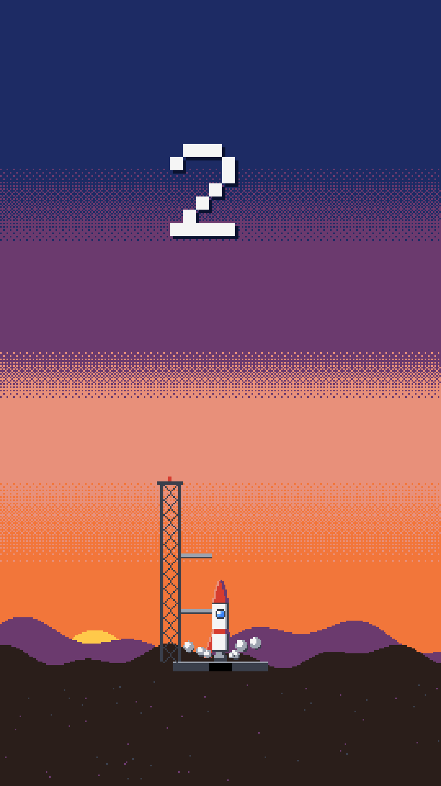
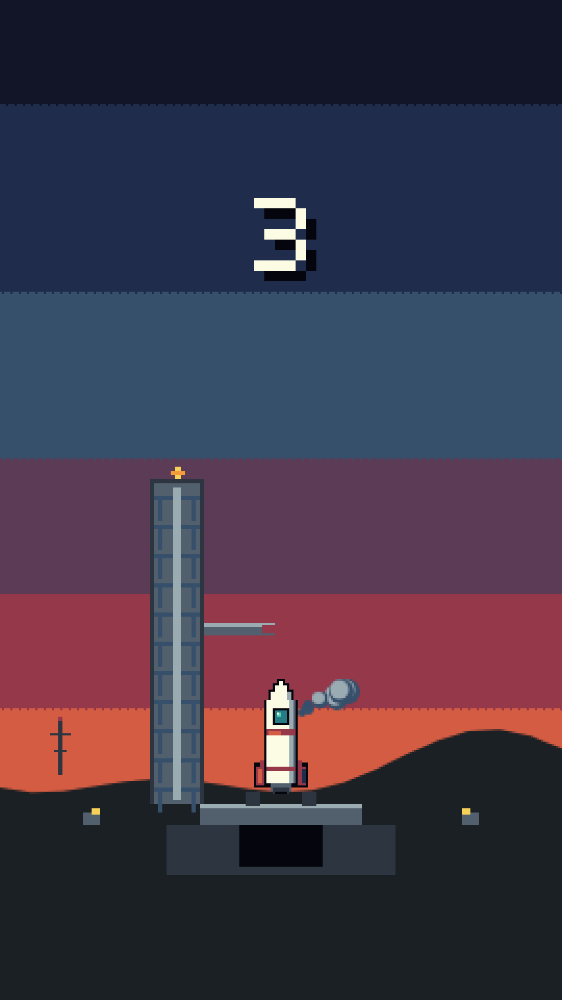
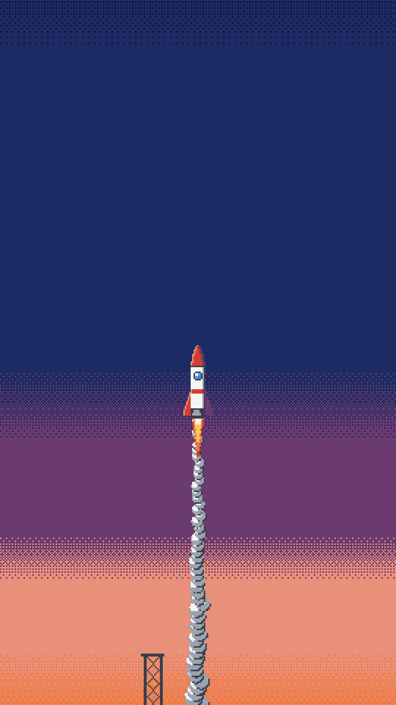
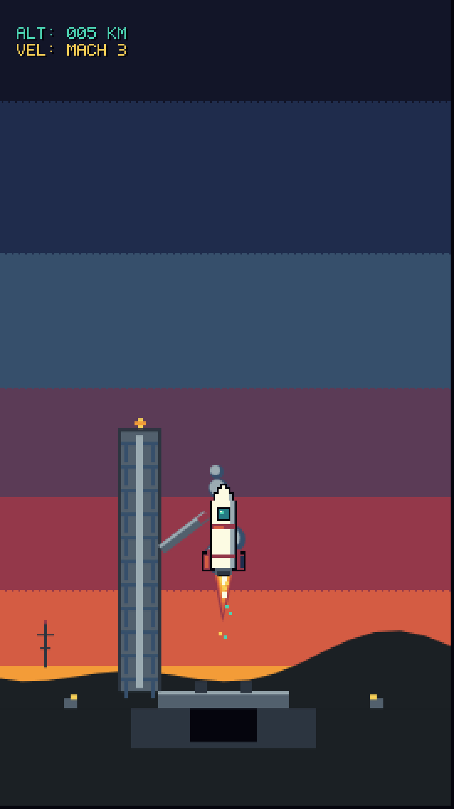
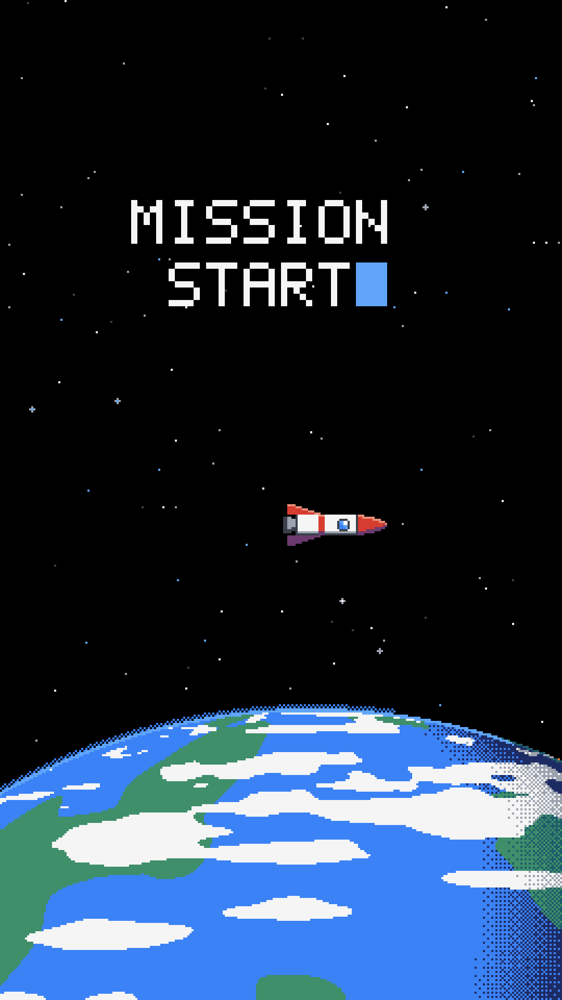
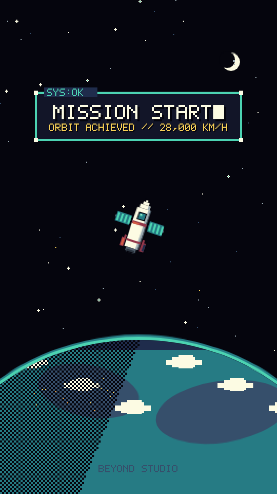
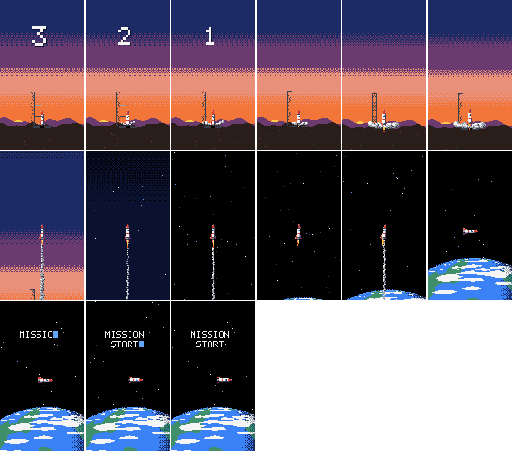
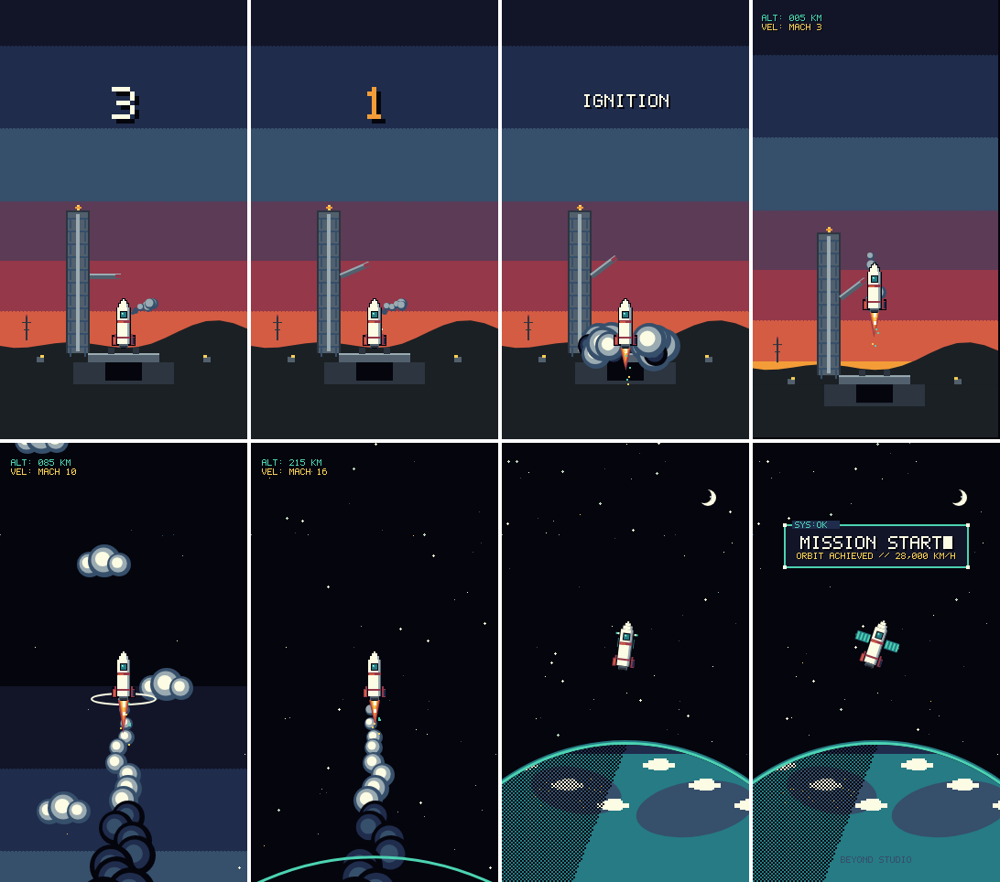

# Rocket Orbit Pixel — Claude vs Gemini

> **Eksperimen Animasi Motion Graphics Pixel Art Vertikal (9:16) Murni Berbasis Kode**  
> Perbandingan implementasi antara **Claude (Opus 5.5)** dan **Gemini (3.8 Flash)** dalam membuat video animasi pixel art 12 detik peluncuran roket dari bumi ke orbit secara deterministik $f(t)$ menggunakan HTML5 Canvas 2D + Web Audio API / PCM synthesis tanpa aset gambar maupun pustaka grafis eksternal.

---

## 🚀 Perbandingan Hasil Visual

| Adegan | Claude (Opus 5.5) | Gemini (3.8 Flash) |
| :--- | :---: | :---: |
| **S1: Hitung Mundur (0–4s)** |  |  |
| **S2: Lepas Landas & Atmosfer (4–8s)** |  |  |
| **S3: Orbit & Mission Start (8–12s)** |  |  |

### 🎞️ Contact Sheet Komparasi

#### 🟣 Claude (Opus 5.5) — 15 Frame Kunci


#### 🔵 Gemini (3.8 Flash) — 8 Frame Kunci


---

## 📊 Matriks Perbandingan Fitur

| Kriteria / Fitur | Claude Opus 5.5 (`roket-orbit-claude`) | Gemini 3.8 Flash (`roket-orbit-gemini`) |
| :--- | :--- | :--- |
| **Resolusi Internal** | 270 × 480 (Canvas 2D) | 270 × 480 (Canvas 2D) |
| **Resolusi Output** | 1080 × 1920 (4x upscale, nearest-neighbor) | 1080 × 1920 (4x upscale, nearest-neighbor) |
| **Framerate & Durasi** | 30 FPS, 360 frames (12.0 detik) | 30 FPS, 360 frames (12.0 detik) |
| **Palet Warna** | 16 warna retro ruang angkasa | 16 warna retro ruang angkasa |
| **Efek Visual S1** | Menara gantry, countdown pop, LOX smoke venting | Service tower, LOX venting, countdown scale-pop, ignition trench burst |
| **Efek Visual S2** | Ekor partikel api, gradient sky dither Bayer, stars | Shock diamonds, Mach condensation cone, gradient sky dither, cluster stars |
| **Efek Visual S3** | Bumi lengkung, kelap-kelip bintang, HUD typewriter | Sayap solar panel mekar, rotasi bumi malam-siang, RCS burst, HUD retro `█` |
| **Sintesis Audio** | Musik chiptune 4 baris synth + SFX countdown, launch, orbit (WAV 48kHz) | BGM chiptune 120 BPM + procedural SFX (beeps, rocket rumble, teletype) |
| **Arsitektur Rendering** | Playwright frame-by-frame PNG dump &rarr; FFmpeg concat | Playwright direct pipe RGBA buffer stream &rarr; FFmpeg |
| **Dependensi Eksternal** | Murni kode (0 library gambar, hanya `playwright` dev runner) | Murni kode (0 library gambar, hanya `playwright` dev runner) |

---

## 📁 Struktur Direktori

```text
rocket-orbit/
├── previews/                 # Cuplikan still & contact sheet komparasi
├── roket-orbit-claude/       # Implementasi lengkap versi Claude
│   ├── src/                  # Kode sumber (Canvas 2D, font, palette, scenes)
│   ├── tools/                # Script render, audio synth, CLI tools
│   ├── index.html            # Web preview interaktif
│   ├── package.json          # Script & dependencies
│   ├── TREATMENT.md          # Dokumen arahan artistik & storyboard
│   └── README.md             # Petunjuk khusus versi Claude
├── roket-orbit-gemini/       # Implementasi lengkap versi Gemini
│   ├── src/                  # Kode sumber (film, sprites, font, palette, audio)
│   ├── render.mjs            # Renderer terpadu Playwright + FFmpeg
│   ├── index.html            # Web preview interaktif
│   ├── package.json          # Script & dependencies
│   ├── TREATMENT.md          # Dokumen arahan artistik & storyboard
│   └── README.md             # Petunjuk khusus versi Gemini
├── .gitignore
└── README.md
```

---

## 🛠️ Cara Menjalankan

### 1. Menjalankan Versi Claude (`roket-orbit-claude`)

```bash
cd roket-orbit-claude
npm install

# Live preview interaktif di browser (http://localhost:5199)
npm run preview

# Ekspor tangkapan still per adegan
npm run stills

# Sintesis file audio BGM + SFX
npm run audio

# Render video final MP4 lengkap
npm run build
# Hasil: out/roket-orbit-claude.mp4
```

### 2. Menjalankan Versi Gemini (`roket-orbit-gemini`)

```bash
cd roket-orbit-gemini
npm install

# Live preview interaktif di browser (http://localhost:5173)
npm run preview

# Uji konsistensi & determinisme frame f(t)
npm run check

# Ekspor still kunci resolusi penuh (1080x1920)
npm run stills

# Buat contact sheet dari still (out/sheet.png)
npm run sheet

# Sintesis audio BGM chiptune + SFX
npm run audio

# Render video final MP4 lengkap
npm run render
# Hasil: out/roket-orbit.mp4
```

---

## 📋 Prasyarat Sistem
- **Node.js**: v18+ (direkomendasikan v20+)
- **FFmpeg**: Terpasang di sistem dan terdaftar dalam `PATH`
- **Playwright Chromium**: `npx playwright install chromium`

---

## 📄 Lisensi
MIT License
